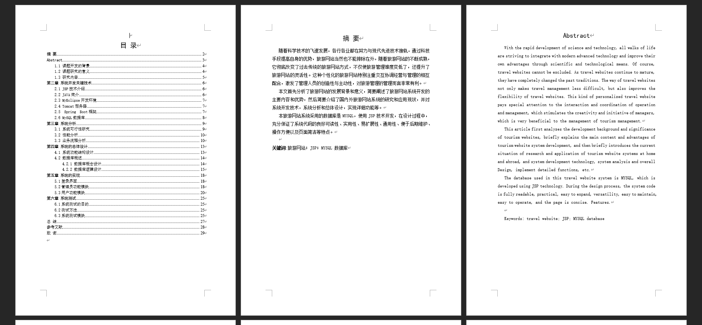
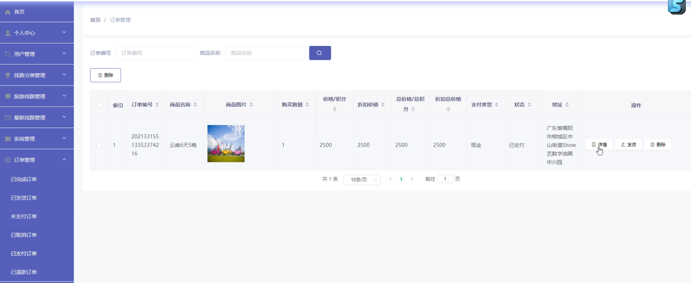

基于Springboot的旅游网站（程序+论文）
=
### 完整代码获取地址：从戎源码网 ([https://armycodes.com/](https://armycodes.com/))
### 作者微信：19941326836  QQ：952045282 
### 承接计算机毕业设计、Java毕业设计、Python毕业设计、深度学习、机器学习
### 选题+开题报告+任务书+程序定制+安装调试+论文+答辩ppt 一条龙服务
### 所有选题地址https://github.com/nature924/allProject

一、项目介绍
---
系统包含两种角色：用户、管理员，系统分为前台和后台两大模块，主要功能如下：

### 用户功能模块
1. 用户注册界面:
   - 用户可进行注册操作。

2. 用户登录界面:
   - 用户需登录后才能进行商品购买等操作。

3. 系统主界面:
   - 用户可查看系统信息，包括首页、商品信息、团购信息等。

4. 商品详情界面:
   - 用户可查看商品详情，并进行收藏、加入购物车和购买操作。

5. 购物车界面:
   - 用户可查看购物车商品信息，并进行修改数量、删除商品及购买操作。

6. 我的订单界面:
   - 用户可查看个人订单信息。

7. 团购详情界面:
   - 用户可查看团购详情，并进行加入购物车、购买或收藏操作。

### 管理员功能模块
1. 管理员登录界面:
   - 管理员需通过正确的账号、密码进行登录操作。

2. 用户管理界面:
   - 管理员可查看、添加、修改、删除用户信息。

3. 商品信息管理界面:
   - 管理员可增删改查商品信息。

4. 团购信息管理界面:
   - 管理员可添加、修改和删除团购信息。

5. 订单管理界面:
   - 管理员可查看所有订单信息，并对未发货订单进行发货操作。

二、项目技术
---
- 编程语言：Java
- 数据库：MySQL
- 项目管理工具：Maven
- 前端技术：VUE、HTML、Jquery、Bootstrap
- 后端技术：Spring、SpringMVC、MyBatis

三、运行环境
---
- 操作系统：Windows、macOS都可以
- JDK版本：JDK1.8以上都可以
- 开发工具：IDEA、Ecplise、Myecplise都可以
- 数据库: MySQL5.7以上都可以
- Tomcat：任意版本都可以
- Maven：任意版本都可以

四、运行截图
---
### 论文截图：

### 程序截图：

